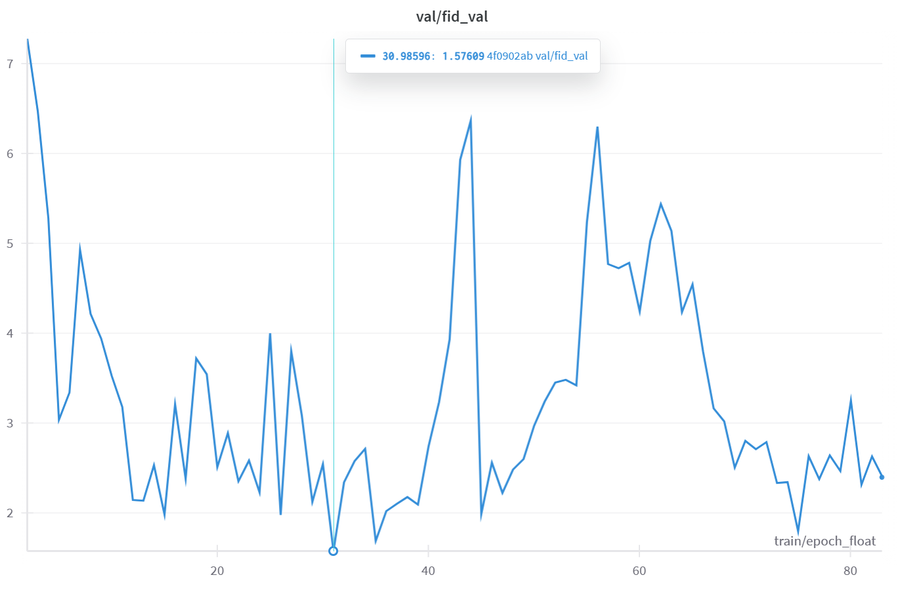

# Aging CycleGAN
Aging GAN is an unpaired image-to-image translation project for facial age transformation built on a CycleGAN-style framework. Created with PyTorch, it provides end-to-end tooling—from data preprocessing to training, checkpointing, and a live Gradio demo—while offering infrastructure utilities to simplify training on AWS EC2 instances. The model trains two ResNet‑style "encoder-residual-decoder" generators and two PatchGAN discriminators on the UTKFace dataset, split into **Young** and **Old** subsets. The generators learn to translate between these domains, effectively "aging" or "de-aging" a face image.

This repository contains training scripts, helper utilities, inference scripts, and a Gradio app for demo purposes.

## Motivation
Face‑aging models aren't just "fun filters" on social apps, but address real needs across law enforcement, healthcare, and even entertainment. One of the most important applications is in forensic science and missing‑person investigations. When a child vanishes, every year that passes makes their appearance shift. Age‑progressed images generated by an aging GAN can help police and the public recognize what the child might look like today. Those same techniques assist in cold‑case searches for adults, helping law enforcement update outdated photographs to increase the chances of identification. In healthcare and dermatology, face‑aging networks can even simulate how a patient's skin is likely to evolve under various conditions. Different tasks would require different datasets and architectures, but you would be able to learn how a theory can convert to meaningful application through this project.

## Features
- **CycleGAN Architecture** - ResNet‑style "encoder-residual-decoder" generators and PatchGAN discriminators. In addition to adversarial loss, cycle‑consistency loss was used to preserve content/structure. Moreover, identity loss was added to preserve color and style of the original image.
- **Data Pipeline & Preprocessing** - deterministic train/val/test splits, on-the-fly augmentations, unpaired DataLoader that pairs Young (18–28) and Middle-aged/Old (40+) faces at each batch.
- **Training Utilities & Efficiency** - gradient clipping to stabilize adversarial updates, separate generator/discriminator learning rates with linear decay for latter half of training, mixed precision via `accelerate` for 2× speed/memory improvements, and checkpointing models with per-epoch generated sample images for evaluation.
- **Evaluation** - FID (Frechet Inception Distance) evaluation on validation and test splits.
- **Weights & Biases Logging** - track losses and metrics during training.
- **Inference Utilities** - command-line interface for image generation on user input.
- **AWS Utilities** - when running on EC2, IAM-ready scripts to automatically sync `outputs/` to S3 after saving checkpoints and terminate the instance after full training.
- **Gradio Demo** – ready-to-deploy web app for interactive predictions. Hosted on [Huggingface Spaces](https://huggingface.co/spaces/codinglabsong/aging-gan).
- **Reproducible Workflows** - configuration-based training/inference scripts and environment variables. Optionally set seed during training.
- **Developer Tools** - linting with ruff and black, plus  unit tests.

## Installation
1. Clone this repository and install the core dependencies:
    ```bash
    pip install -r requirements.txt
    ```

2. (Optional) Install development tools for linting and testing:
    ```bash
    pip install -r requirements-dev.txt
    pre-commit install
    ```

3. Install the package itself (runs `setup.py`):

    ```bash
    # Standard install:
    pip install .

    # Or editable/development install:
    pip install -e .
    ```

## Data Preprocessing
We leverage the UTKFace dataset—a public collection of over 20,000 face images with age annotations (0–116), then use the aligned and cropped version for consistency. You can download from [here](https://www.kaggle.com/datasets/jangedoo/utkface-new).

Place your data on project root at:
> data/utkface_aligned_cropped/UTKFace

The prepare_dataset function handles:
- Age-based splits: thresholds at 18–28 for Young, 40+ for Old, ignoring mid-range ages. 7134 examples were filtered for each Young and Old pair. The reasoning behind removing children under age 18 was to help the model converge better as the facial shape often differs a lot between children and adults. It was observed that the model converges better when removing photos of babies that have much larger eye proportions and a rounder face.
- Deterministic shuffling: 80% train, 10% validation, 10% test with a fixed RNG seed.
- Augmentations (train only): random horizontal flips, resizing to img_size+50, center/random cropping to img_size, random rotations up to 80°, and normalization to [-1, 1].
- Evaluation transforms: resize → center crop → normalization (no randomness).

This pipeline ensures both diversity (via augmentation) and reproducibility (fixed splits and RNG).

## Usage
### Training
Use the wrapper script to launch training with your preferred hyper‑parameters:

```bash
bash scripts/run_train.sh --num_train_epochs 50 --lambda_cyc_value 4.0 --train_batch_size 4 --gen_lr 0.0002 --disc_lr 0.0002 --num_sample_generations_to_save 10 --archive_and_terminate_ec2
```

Additional options are available via:

```bash
bash scripts/run_train.sh --help
```

### Inference (CLI)
Generate aged faces using the command-line helper:

```bash
bash scripts/run_inference.sh --input path/to/face.jpg --direction young2old --ckpt outputs/checkpoints/best.pth
```

Or, get test metrics on the test set:

```bash
bash scripts/run_inference.sh --mode test
```

Both script loads `outputs/checkpoints/best.pth` by default and saves the result beside the input.

## Results


| Test Metric | Value |
| ------ | ----- |
| fid_val | *1.629076* |
| loss_DX | *0.236699* |
| loss_DY | *0.221634* |
| loss_gen_total | *3.057503* |
| loss_f_adv | *1.411055* |
| loss_g_adv | *0.835522* |
| loss_cyc | *0.736225* |
| loss_id | *0.074702* |

These results are on the test set for the model checkpoint that received the lowest `fid_val` (Frechet Inception Distance). The generated image qualities per checkpoint was also taken into consideration in finally choosing this model.

You can download this checkpoint model on [Releases](https://github.com/codinglabsong/aging-gan/releases/tag/v1.0.0).

### Example Outputs
We can see the transition between the young and the middle-aged or old.

<table>
  <caption style="caption-side:top; font-weight:bold; text-align:center;">
    Young -> Old
  </caption>
  <tr>
    <th>Input 1</th><th>Input 2</th><th>Input 3</th>
  </tr>
  <tr>
    <td></td>
    <td></td>
    <td></td>
  </tr>
  <tr>
    <td></td>
    <td></td>
    <td></td>
  </tr>
</table>

<table>
  <caption style="caption-side:top; font-weight:bold; text-align:center;">
    Old -> Young
  </caption>
  <tr>
    <th>Input 1</th><th>Input 2</th><th>Input 3</th>
  </tr>
  <tr>
    <td></td>
    <td></td>
    <td></td>
  </tr>
  <tr>
    <td></td>
    <td></td>
    <td></td>
  </tr>
</table>

### Considerations for Training and Improving Model
In the case you have time and resources to better train and improve the model, good points to start are...

- **Increase the dataset** size by adding not noisey and high quality data. The limit of the dataset was usually due to the lack of images for the Old group, so adding more images of older faces would certainly help.
- Consider using **various evaluation metrics**. There is often not always a best single metric to measure image quality for validation. Utilize other metrics such as KID (Kernel Inception Distance), which yield better results with small-sample behavior, or LPIPS (Learned Perceptual Image Patch Similarity) to measure how well your model preserves content or produces diverse outputs. Moreover, **qualitative human evaluation** on generated samples is good practice for these image generation models instead of relying on just metrics.
- Use a **small batch size**. I made the mistake in the beginning of aiming for a too high batch size for efficiency, but the discriminator easily memorized the training dataset. Lowering batch sizes to 1-16 are recommended, espeically if you have limited data. Also, you may consider adding gradient penalty or spetral normalization to hinder the discimrinator from memorization.
- Train for **more epochs**. Approach this with caution for GANs, as it might easily lead to overfitting. It is typical for the best models to be produced before training ends. Use your additional metrics as explained previously to choose the best checkpoint.
- If you really desire to output higher quality results, experiment with other **architectures** or strategies that often yield better results such as CAAE (Conditional Adversarial Autoencoders), StarGAN v2, or AttGAN.
- Extensive **hyperparameters sweeps** would also improve your hyperparameter choices, but may be computationally expensive and time consuming.

## Running the Gradio Inference App
This project includes an interactive Gradio app for making predictions with the trained model.

1. **Obtain the Trained Model:**
    - Ensure that a trained model directory (e.g., `outputs/checkpoints/best.pth`) is available in the project root.
    - If you trained the model yourself, it should be saved automatically in the project root.
    - Otherwise, you can download it from [Releases](https://github.com/codinglabsong/aging-gan/releases/tag/v1.0.0) and add it in the project root.

2. **Run the App Locally:**
    ```bash
    python app.py
    ```
    - Visit the printed URL (e.g., `http://127.0.0.1:7860`) to interact with the model.

> You can also access the hosted demo on [Huggingface Spaces](https://huggingface.co/spaces/codinglabsong/aging-gan)

## Testing
Run unit tests with:

```bash
pytest
```

## Repository Structure
- `src/aging_gan/` - core modules (`train.py`, `model.py`, etc.)
- `scripts/` - helper scripts for training and inference
- `notebooks/` - exploratory notebooks
- `tests/` - standard unit tests
- `outputs/` - generated directory for training outputs including `checkpoints/`, `images/` (for generated images per epoch), `metrics/test_metrics.json` (for storing test metrics from `best.pth` after training)

## Requirements
- Python ≥ 3.10
- PyTorch >= 2.6
- Additional packages listed in `requirements.txt`

## Contributing
Contributions are welcome! Feel free to open issues or submit pull requests.

## Acknowledgements
- [Original Generative Adversarial Networks Paper](https://arxiv.org/abs/1406.2661)
- [Cycle-Consistent Adversarial Networks Paper](https://arxiv.org/abs/1703.10593)
- [Young2Old Input 1 Image](https://www.freepik.com/free-photo/person-woman-smiling-studio-portrait_1160249.htm#fromView=keyword&page=1&position=0&uuid=3ae6d09f-2ab3-4572-8c45-552fd6c685fb&query=Young+Girl+Face)
- [Young2Old Input 2 Image](https://www.pexels.com/photo/shallow-focus-photography-of-woman-1458332/)
- [Young2Old Input 3 Image](https://www.freepik.com/free-photo/front-view-man-posing_6113006.htm#fromView=keyword&page=1&position=0&uuid=5fbe03b4-8b89-46e1-bd2f-1a98060bec7e&query=Young+Man+Face)
- [Old2Young Input 1 Image](https://www.yourtango.com/self/gen-x-youngest-old-people)
- [Old2Young Input 2 Image](https://www.usatoday.com/story/entertainment/celebrities/2024/03/28/ernie-hudson-age-ghostbusters-frozen-empire/73139462007/)
- [Old2Young Input 3 Image](https://www.iese.edu/standout/women-board-directors-keys-leadership/)

## License
This project is licensed under the [MIT License](LICENSE).
